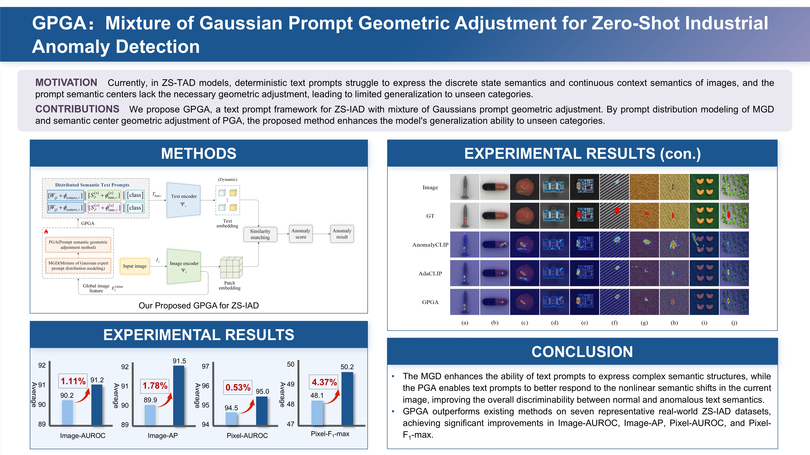
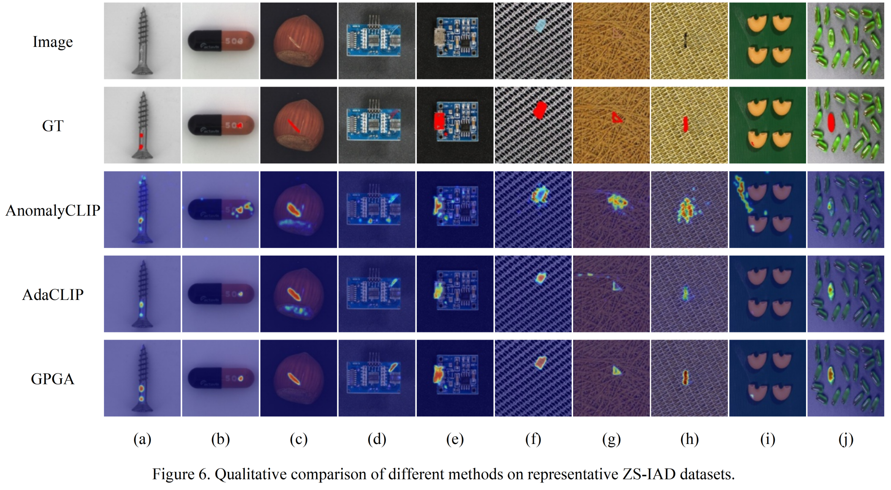
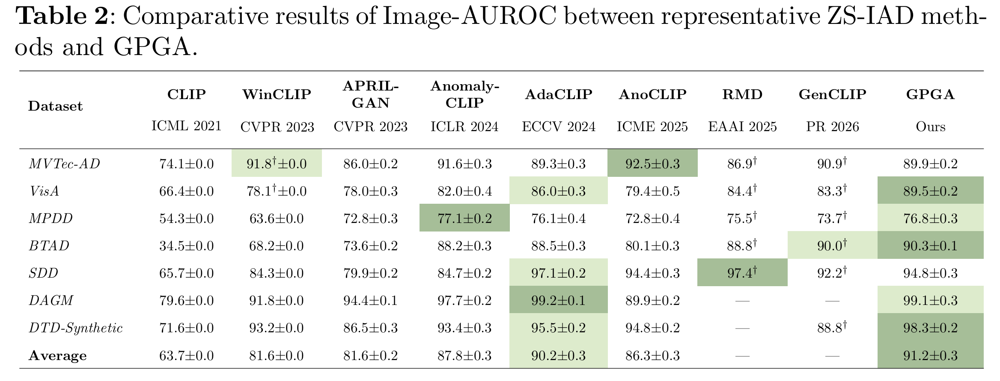
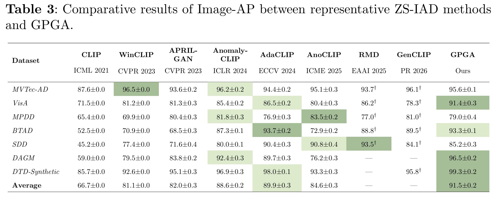
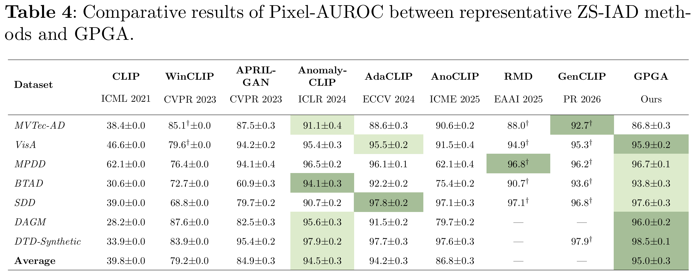
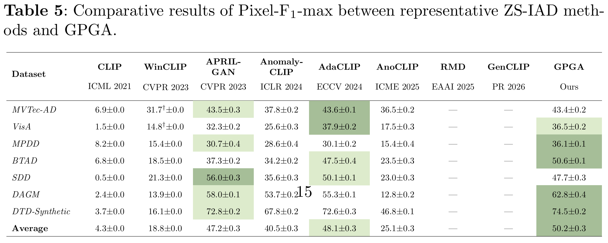

# GPGA
Mixture of Gaussian Prompt Geometric Adjustment for Zero-Shot Industrial Anomaly Detection

## Introduction

  

  <strong>Abstract:</strong> Existing zero-shot industrial anomaly detection methods commonly rely on deterministically designed text prompts and lack geometric adjustment of the prompt semantic centers, which makes it difficult to capture the semantics of discrete states and continuous contexts, thereby limiting generalization to unseen categories. To address this issue, we propose GPGA, a text prompt framework with mixture of Gaussian prompt geometric adjustment (GPGA). The proposed GPGA employs a mixture of Gaussian expert prompt distribution to embed the semantics of discrete states and continuous contexts from images into a unified prompt space, thereby improving the capacity of text prompts to capture complex semantic structures. It further develops a prompt semantic geometric adjustment method that applies nonlinear geometric adjustment to the prompt semantic centers, enabling the text prompts to better respond to nonlinear semantic shifts in the current image, thus enhancing generalization in zero-shot industrial anomaly detection. Experimental results on seven representative industrial anomaly detection datasets show that GPGA achieves average Image-AUROC=91.2±0.3, Image-AP=91.5±0.2, Pixel-AUROC=95.0±0.3, and Pixel-F1-max=50.2±0.3, outperforming advanced methods by 1.11%, 1.78%, 0.53%, and 4.37%, respectively. Moreover, GPGA demonstrates strong capability in accurately detecting diverse anomaly types in complex industrial scenarios.

## Overview of GPGA

## Main Results

##  News
- 2026-02-05: Submitted to Journal of King Saud University Computer and Information Sciences
- The paper is currently under review. The code will be made available upon acceptance.

##  Acknowledgements
Our repository is built upon [AdaCLIP](https://github.com/caoyunkang/AdaCLIP), [AnomalyCLIP](https://github.com/zqhang/AnomalyCLIP). We thank to all the authors for their awesome works.
